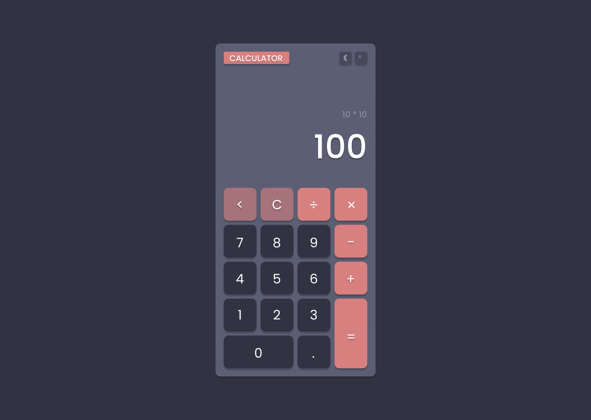
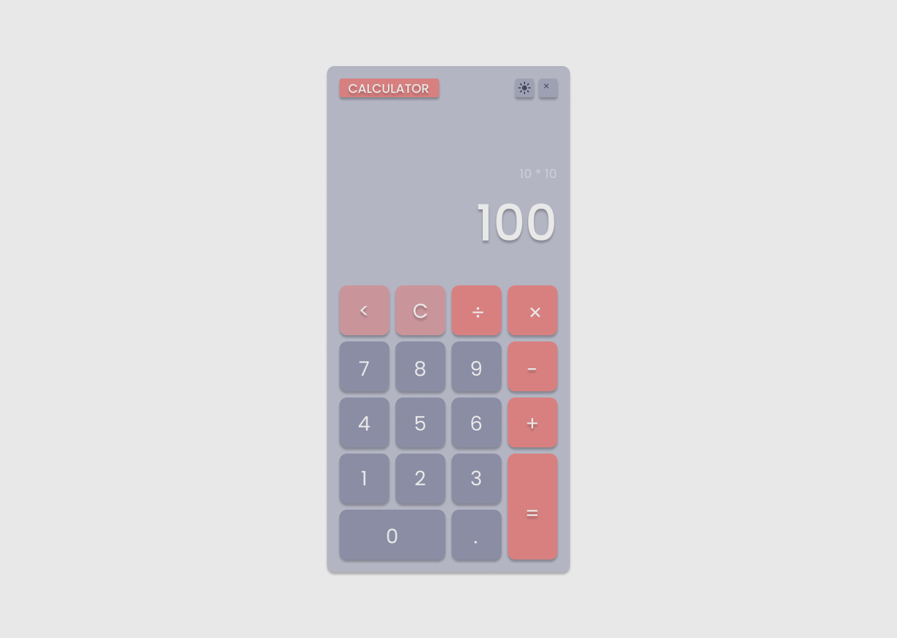

<h1 align="center">CALCULATOR 🔢 </h1>

> Projeto pessoal 

Projeto pessoal desenvolvido durante aprendizado, focado na criação de uma calculadora responsiva seguindo a abordagem "Mobile First".

A calculadora oferece funcionalidades básicas de cálculo, sendo projetada de forma intuitiva e amigável para facilitar a interação do usuário. O código-fonte está disponível no GitHub, fornecendo uma oportunidade para colaboração, revisão e aprimoramento contínuo. Durante o desenvolvimento, foram aplicados conceitos de design responsivo e boas práticas de programação para criar uma aplicação eficiente e fácil de usar.

 

[Clique aqui para acessar](https://lubernardino.github.io/Calculator/)

### 🧪 Tools

- HTML
- CSS
- JavaScript (ES6 Modules)
- Git e Github

Create with 💜 by Luana Bernardino 🤓

